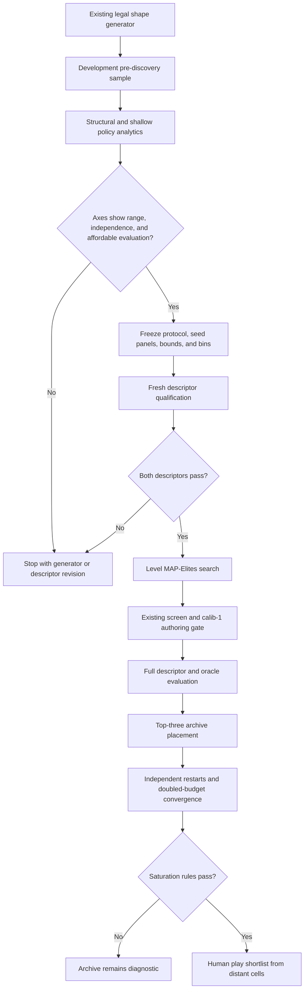
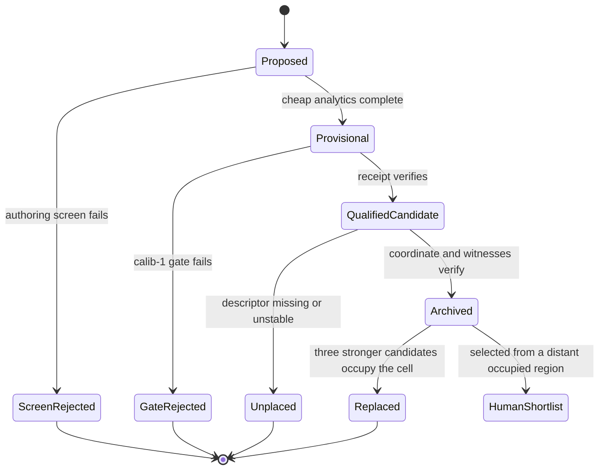

# Level MAP-Elites Authoring - Plan

## Goal Capsule

- **Objective:** Give level authors a reproducible map of candidate level designs organized by successful plan breadth and harvesting advantage, with enough evidence to distinguish genuinely empty regions from weak search.
- **Means:** Qualify both descriptors on fresh data, evolve legal level shapes with a separate level MAP-Elites pipeline, and retain replay-valid authoring candidates across the supported behavior space.
- **Authority:** `calib-1` remains the target-setting and viability instrument; the bounded oracle supplies best-known witnesses and policy comparisons; human play supplies the final judgment about whether distant regions feel different and worthwhile.
- **Stop conditions:** Stop before archive construction if either descriptor lacks range, is unstable across seeds or search budgets, or cannot be moved independently by the available level mutations. Stop before claiming saturation if independent restarts and a doubled budget do not converge.
- **Finish line:** A verified archive report exposes multiple candidates per occupied region, honest reasons for every empty region, replayable oracle evidence, and a small set of strategically distant candidates ready for human play.

---

## Product Contract

### Summary

Build a separate level-authoring MAP-Elites system over two continuous descriptors: successful plan breadth and harvesting advantage. Pre-discovery analytics determine whether the proposed space is measurable and navigable before a frozen qualification run or full archive search begins.

### Problem Frame

The existing generator can invent legal shapes and pass survivors through the frozen authoring pipeline, but its shortlist is ordered by `calib-1` win rate. That ranks apparent difficulty without describing the gameplay a board rewards. The existing MAP-Elites implementation evolves bot policies using mean chain length and late-score share; it does not evolve or classify level designs.

The desired authoring instrument must find strategically different boards rather than more boards from the same narrow family. It must also avoid treating a lucky seed, one bounded witness, or an arbitrarily divided rectangle as a property of a level design. Previous descriptor work demonstrates why: opening diversity collapsed on representative boards, and the merge-depth by spatial-spread archive filled its four cells while failing its cross-search cell-stability bar.

### Requirements

**Descriptor meaning**

- R1. The X-axis describes successful plan breadth: how many materially distinct first-decision outcomes retain a replayable route to the target under a named search bound.
- R2. The Y-axis describes harvesting advantage: the paired loss-adjusted move advantage of the harvesting ranker over an immediate-score ranker on identical level instances and search bounds.
- R3. A coordinate describes one authored level design across a frozen seed panel, not one initial deal; exact-board rows and witnesses remain inspectable supporting evidence.
- R4. Both axes preserve raw per-seed measurements, aggregation rules, missingness, uncertainty intervals, and `UNKNOWN` outcomes instead of retaining only a cell label.
- R5. Difficulty remains separate from both descriptors and appears as authoring quality or display metadata, never as part of either axis.

**Evidence separation**

- R6. Pre-discovery uses an explicitly developmental sample to measure range, correlation, cost, seed sensitivity, search-depth sensitivity, and mutation response.
- R7. Descriptor formulas, aggregation, seed panels, search bounds, bin boundaries, and promotion bars are frozen in a committed protocol before any fresh qualification outcome is observed.
- R8. Qualification uses fresh level identities and seed ranges that do not overlap pre-discovery, target fitting, candidate holdout, or later archive evaluation.
- R9. A bounded search miss remains `UNKNOWN`; it never means a route, candidate, or map region is impossible.
- R10. The full archive run begins only after both descriptors pass their registered range, stability, and manipulation checks.

**Level generation and archive behavior**

- R11. The level genome uses only authoring capabilities already accepted by the current level schema: dimensions, move budget, minimum chain length, demand, and blocker configuration.
- R12. Every generated genome must pass the existing shape validator and cheap authoring screen before expensive calibration or descriptor evaluation.
- R13. Only candidates with a verified `calib-1` authoring receipt and replay-valid descriptor evidence may enter the final archive; cheap or provisional measurements may guide exploration but cannot occupy final cells.
- R14. Parent selection must preserve diversity across occupied cells, continue injecting unrelated random candidates, and direct additional trials toward the frontier around empty cells.
- R15. Each occupied cell retains up to three distinct candidates rather than one global winner.
- R16. Within-cell ordering is transparent and lexicographic: valid evidence first, seed-panel reliability second, then authoring pace pressure; no weighted scalar may silently combine style, difficulty, and reliability.

**Search adequacy and human handoff**

- R17. Search adequacy is reported through discovery curves, multiple independent restarts, a doubled-budget continuation, occupied-cell agreement, and the number of new eligible cells found after the original stopping point.
- R18. Empty regions are classified as outside the frozen envelope, rejected by authoring gates, searched without discovery, descriptor-unstable, or not yet searched.
- R19. Persistent searched-but-empty cells remain unresolved even when every restart misses them.
- R20. The authoring report selects candidates from strategically distant occupied cells for human play and preserves the exact candidate, seed, target-stop objective, oracle witness, and cell identity used for that selection.
- R21. Human play determines whether distant cells feel meaningfully different; machine descriptors do not certify fun, fairness, or difficulty.

### Success Criteria

- Both descriptors pass a preregistered fresh qualification that includes positive, negative, and orthogonal controls, range across multiple bins, cross-seed stability, and shallow-versus-deep search stability.
- Pre-discovery shows at least one legal mutation family can move each descriptor in each direction without requiring a corresponding movement on the other axis; otherwise the plan stops for generator redesign.
- The archive artifact can replay every retained candidate's authoring receipt and every witness used to calculate its coordinate or quality.
- Independent restarts and the doubled-budget run satisfy the saturation rules frozen after pre-discovery; the report preserves any failure rather than rounding it into a successful coverage claim.
- At least three strategically distant occupied regions each retain a candidate eligible for human play, without requiring all grid cells to be occupied.
- Human sessions from those regions can be compared on the intended behavioral distinctions without changing the shipped game or target-setting policy.

### Key Decisions

- **Continuous behavioral space.** Use continuous successful plan breadth and harvesting advantage rather than four named gameplay buckets. Difficulty is a separate annotation.
- **Qualification before archive.** Treat pre-discovery and fresh descriptor qualification as admission gates for MAP-Elites, not as optional analysis after the archive exists.
- **Separate level archive.** Evolve level designs in a new pipeline instead of changing the meaning of the existing policy MAP-Elites experiment.
- **Multiple candidates per region.** Preserve up to three candidates in each occupied region so human review is not constrained by one machine ranking.

### Scope Boundaries

This plan does not change game rules, scoring, spawn behavior, `calib-1`, shipped levels, or the live bot. It does not add authored starting tiles or off-lattice starting pieces to the current level schema. It does not claim that a filled map is exhaustive or that an empty cell is unreachable.

#### Deferred to Follow-Up Work

- Add authored starting-tile layouts only if pre-discovery shows that the current genome cannot navigate the proposed behavior space.
- Add off-lattice soft-blocker mutations after their recovery cost and player readability have separate support.
- Replace the rectangular grid with centroidal or adaptive MAP-Elites only if the qualified attainable envelope makes fixed bins materially misleading.
- Promote any human-confirmed map region into a shipped level family through the existing measured level-design process.

---

## Planning Contract

### Key Technical Decisions

- KTD1. **Keep the level archive separate from policy MAP-Elites.** Create a new `solver/level-map/` boundary while reusing the existing archive mechanics, identity discipline, and render conventions where they still fit. (session-settled: user-approved — chosen over repurposing the policy archive: the two systems evolve different subjects and use different descriptors.) Governs R11-R18.
- KTD2. **Measure designs over seed panels.** A level coordinate aggregates per-seed rows from one frozen panel; each row retains the exact initialized puzzle identity and paired-policy evidence. A single seed may be displayed but cannot locate the level. Governs R3, R4, R8, and R20.
- KTD3. **Use comparable and behavior-checked policy arms for harvesting advantage.** Both arms use the same legal action generator, seeded stream, work cap, terminal rule, and beam portfolio. The immediate arm ranks accumulated score only; the harvesting arm uses the evolved harvesting ranker. Per-seed advantage is `(immediate effective moves - harvest effective moves) / move budget`, where a loss has `move budget + 1` effective moves. Qualification must also show that the arms produce the intended behavioral contrast on controls through immediate-score choice, constructed harvestable mass, and harvest concentration; otherwise the quantity remains an unnamed policy differential and fails promotion as harvesting advantage. Preserve win/loss counts beside the aggregate so the axis never hides outcome changes. Governs R2, R4, R5, and R9.
- KTD4. **Measure successful plan breadth by first-outcome classes and preserve an uncertainty interval.** Deduplicate legal first moves by their resulting board, draw cursor, move count, and score. Search each distinct successor independently for a target witness. The conservative lower bound is successful successors divided by all distinct successors; the upper bound also counts cap-exhausted successors as potentially successful. A level receives a stable X coordinate only when the frozen aggregation of that interval fits one bin under the registered rule. Governs R1, R4, and R9.
- KTD5. **Freeze the map only after pre-discovery.** The per-seed descriptor definitions in KTD3 and KTD4 are fixed before development data. Pre-discovery may choose the cross-seed aggregation statistic, seed-panel size, grid resolution between 5 by 5 and 7 by 7, axis bounds, and fixed-bin cut points. Fresh qualification and archive runs consume those frozen values without retuning. (session-settled: user-approved — chosen over immediately building a 7 by 7 archive: the project has already seen plausible descriptors collapse or move cells under deeper search.) Governs R6-R10 and R17.
- KTD6. **Use a fixed rectangular grid for the first admitted archive.** This follows the project's existing inspectable grid and axis-identity pattern. Pre-discovery must stop the effort rather than force a grid when the attainable envelope is too thin, highly correlated, or disconnected; adaptive archives remain follow-up work. Governs R10, R17, and R18.
- KTD7. **Use top-three lexicographic cell retention.** Final cell membership requires valid receipts and witness replays. Candidates then rank by successful oracle coverage across the frozen seed panel and by closeness to the desired pace-pressure band. No weighted fitness function combines those concerns. (session-settled: user-approved — chosen over one elite per cell or folding difficulty into an axis: several candidates preserve author judgment and keep style separate from challenge.) Governs R5, R13, R15, and R16.
- KTD8. **Keep provisional search separate from final archive evidence.** Cheap structural measures and shallow policy probes may prioritize genomes, but only the full frozen descriptor evaluator determines a final cell. Every artifact labels the measurement tier that produced each row. Governs R6, R12, R13, and R17.
- KTD9. **Treat search adequacy as convergence evidence.** The qualification protocol fixes restart count, original and doubled budgets, coverage-agreement statistic, and acceptable late-discovery rate after pre-discovery prices the search. Missing a bar returns `INCONCLUSIVE` or `REVISE`; it cannot be waived by visual inspection of a populated map. Governs R17-R19.
- KTD10. **Adopt the evolved policy narrowly for authoring.** Record the owner's decision to use the trace-reviewed RESULT-0041 subject as an authoring policy while preserving that experiment's `UNVERIFIED` closure and its two observed per-puzzle regressions. Use an authoring portfolio for best-known witnesses so the evolved ranker supplements rather than replaces other search arms. Governs R2, R5, R13, and R20.

### High-Level Technical Design

The authoring pipeline has a deliberate evidence gate between exploratory measurements and any reportable archive.



Every candidate carries an explicit evidence lifecycle so a cheap measurement cannot silently become a final elite.



### Output Structure

```text
solver/level-map/
├── archive.js
├── cli.js
├── descriptors.js
├── evaluator.js
├── genome.js
├── pre-discovery.js
├── report.js
└── search.js
```

The exact split may contract during implementation, but descriptor computation, search mechanics, and report verification must remain independently testable.

### Dependencies and Prerequisites

- The implementation branch must include the bounded oracle and evolved harvesting ranker currently ending at `experiment/harvest-policy-corpus` commit `c88668d`.
- `solver/engine.js` and `solver/level-author.js` remain unchanged because their hashes are embedded in existing candidate receipts.
- `solver/generate-levels.js` supplies the existing sampling space, legality-preserving sampler, shape identity, and cheap screen without changing its current batch-selection contract.
- A new reportable qualification or archive claim must reserve and commit its experiment protocol before fresh outcome data is generated.

### System-Wide Impact

- **Existing evidence:** Candidate receipt behavior stays unchanged because the plan imports from, but does not edit, `solver/engine.js` or `solver/level-author.js`. Historical oracle experiment artifacts remain immutable; the new owner decision authorizes prospective authoring use.
- **Compute:** Independent first-action continuation search multiplies oracle work by the number of deduplicated opening outcomes. U2 must measure this cost before U3 freezes panel sizes or U6 commits to an archive budget.
- **Generated artifacts:** Development analytics, qualification evidence, archive checkpoints, and final reports require distinct identities and directories so exploratory output cannot be consumed as admitted evidence.
- **Human workflow:** The output is a shortlist of unshipped candidates for human evaluation, not a new gameplay surface. Because U7's shortlist candidates are not yet shipped in `src/game.js`, their captures must go through the identity-bound `solver/authoring-server.js` / `recordings/` workflow, not `play-sessions/` — `tools/play-server.js` only resolves against shipped `LEVELS` and cannot bind a session to a candidate identity, which would make U7's exact-candidate replay impossible or ambiguous if a level number is later reused. Candidate receipts remain in their existing evidence path.
- **Failure propagation:** A descriptor qualification failure stops archive work. An archive saturation failure preserves the map as diagnostic and prevents it from becoming the authoring acceptance bar.

### Alternatives Considered

- **Reuse policy MAP-Elites:** Rejected because its genome, descriptors, fitness, and evidence subject are policies rather than level designs.
- **Build a 7 by 7 archive immediately:** Rejected because prior descriptor studies showed that occupancy can coexist with poor stability and that a candidate axis can collapse before mapping.
- **Use adaptive or centroidal MAP-Elites from the start:** Deferred because the existing fixed-grid implementation is inspectable and sufficient when pre-discovery establishes a usable rectangular envelope.
- **Use one weighted authoring fitness:** Rejected because win reliability, pace pressure, style, and human interest answer different questions.
- **Classify exact seeded boards:** Rejected as the primary archive subject because the authoring system ships level designs that produce many seeded instances.

### Risk Analysis and Mitigation

| Risk | Consequence | Mitigation |
| --- | --- | --- |
| Plan breadth is mostly `UNKNOWN` under affordable search | The X-axis reflects compute budget more than board structure | Price independent first-action continuation search during pre-discovery; freeze missingness rules; stop before mapping if decisive coverage is too low |
| Harvest advantage collapses near zero | The Y-axis cannot separate styles | Use paired identical instances, inspect win and move components separately, and require registered range before promotion |
| Both axes move together | Most rectangular cells are structurally unavailable | Run one-variable mutation sensitivity and correlation analysis before fixing bins; stop or redesign rather than stretching boundaries |
| `calib-1` makes every mutation expensive | Search cannot evaluate enough legal genomes | Use cheap analytics only for proposal steering, cache identity-bound results, and admit final cells only after full authoring verification |
| A lucky seed controls a coordinate | The map describes deals rather than designs | Aggregate a frozen seed panel and require cross-panel stability on fresh designs |
| Search fills cells with brittle edge cases | Occupancy overstates usable authoring diversity | Retain reliability before pace pressure, preserve up to three candidates, and require replay-valid evidence for every cell member |
| Historical experiment standing is rewritten during adoption | The evidence ledger becomes misleading | Add a separate owner decision and keep RESULT-0041 `UNVERIFIED` |

---

## Implementation Units

### U1. Adopt the bounded oracle as an authoring dependency

- **Goal:** Bring the existing bounded oracle and evolved harvesting ranker into the implementation baseline with a narrow, recorded authoring decision.
- **Requirements:** R2, R5, R9, R13, R20
- **Dependencies:** None
- **Files:** `solver/oracle/search.js`, `solver/oracle/simulation.js`, `solver/oracle/verify.js`, `solver/oracle/harvest-policy.js`, `solver/oracle/rankers.js`, `solver/tests/oracle.test.js`, `solver/tests/harvestPolicy.test.js`, `EVIDENCE_LEDGER.md`
- **Approach:** Preserve the existing independent witness verifier and deterministic work cap. Add named immediate-score and harvesting rankers plus a portfolio result that retains the shortest independently replayed witness. Add an identity-bound continuation-search seam that accepts an already verified successor state while keeping the current level-and-seed entry point as its wrapper. Record the owner's authoring-only adoption in the same change, without changing RESULT-0041's closure or using the evolved ranker as the shipped bot.
- **Patterns to follow:** `solver/oracle/search.js` ranker injection; `solver/oracle/verify.js` independent replay; append-only owner decisions in `EVIDENCE_LEDGER.md`.
- **Test scenarios:**
  - A fixed puzzle evaluated by both named rankers uses identical legal actions, seed stream, objective, and state cap.
  - The portfolio retains the shorter valid witness when the arms disagree.
  - A ranker that finds no witness remains `UNKNOWN` and does not erase another arm's valid witness.
  - The existing level-and-seed search and the new root-state continuation search return identical results when given the same initial puzzle and work cap.
  - A continuation search rejects a successor whose board, draw cursor, score, or source-puzzle identity does not match its verified root record.
  - A planted illegal chain is rejected by the independent verifier before it can become an authoring result.
  - The historical RESULT-0041 report and closure remain byte-preserved while the new owner decision cites them at their existing standing.
- **Verification:** The oracle modules replay the frozen captured corpus under their existing tests, expose stable named policy arms, and produce a non-regressing best-known authoring witness across the arms.

### U4. Add a legal, navigable level genome

- **Goal:** Give pre-discovery and MAP-Elites deterministic mutation and random-immigrant operators over the existing level-authoring schema.
- **Requirements:** R11, R12, R14
- **Dependencies:** U1
- **Files:** `solver/level-map/genome.js`, `solver/tests/levelMapGenome.test.js`
- **Approach:** Reuse the generator's declared ranges and shape identity. Add reproducible mutations for dimensions, moves-per-cell, minimum chain length, demand, blocker count, blocker type, blocker position, and blocker timing. Track the mutation family on every child so pre-discovery can measure direction and independence. Do not add starting-tile or spawn-rule genes.
- **Patterns to follow:** `solver/generate-levels.js#sampleShape`, `shapeSignature`, and `SPACE`; legality checks in `solver/level-author.js#validateShape` without modifying that hashed file.
- **Test scenarios:**
  - Every random immigrant and every mutation produced across a broad seeded sample passes the existing shape validator.
  - Identical parent, mutation seed, and configuration produce the same child and identity.
  - Every declared gene can change through at least one mutation family while unrelated fields remain fixed.
  - Blocker mutations never overlap cells or produce invalid timers and durations.
  - Name-only changes do not create a distinct genome, while every authoring-relevant field does.
  - Exhausted mutation attempts return an explicit no-child result instead of duplicating a previously evaluated genome.
- **Verification:** The genome layer can reproduce a mutation lineage, identify duplicates, and demonstrate controllable movement in the mutation-sensitivity report without bypassing existing validation.

### U2. Build pre-discovery structural and behavioral analytics

- **Goal:** Describe the attainable level space and price descriptor evaluation before any axis or search protocol is frozen.
- **Requirements:** R1-R6, R11, R12
- **Dependencies:** U1, U4
- **Files:** `solver/level-map/pre-discovery.js`, `solver/level-map/descriptors.js`, `solver/level-map/evaluator.js`, `solver/tests/levelMapPreDiscovery.test.js`, `solver/tests/levelMapDescriptors.test.js`
- **Approach:** Sample legal shapes from the existing generator and record raw structural properties, shallow paired-policy outcomes, route-search coverage, descriptor range, correlation, and evaluation cost. Keep the output explicitly developmental and identity-bind the generator settings, seed ranges, source hashes, and every sampled shape.
- **Execution note:** Add controlled fixture tests before running exploratory data so the development report cannot be trusted without positive, negative, and orthogonal behavior.
- **Patterns to follow:** Trace aggregation in `solver/behavior-descriptors.js`; identity and replay records in `solver/merge-spread-descriptors.js`; screen/full separation in `solver/generate-levels.js`.
- **Test scenarios:**
  - A forced fixture has lower successful plan breadth than a fixture with two independently replayable first outcomes.
  - A harvest-favorable fixture gives the harvesting arm a positive paired advantage while a neutral fixture does not manufacture one.
  - The immediate arm selects more available immediate score on a controlled setup, while the harvesting arm retains more constructed compatible mass and concentrates more score into the later harvest.
  - A policy win without the registered behavioral contrast is reported as policy performance and cannot satisfy the harvesting-axis control.
  - Reordering equivalent first chains does not change the deduplicated first-outcome count.
  - A cap-exhausted continuation widens the plan-breadth interval and cannot improve its conservative lower bound.
  - A plan-breadth interval spanning two bins prevents stable placement even when its midpoint lies cleanly inside one bin.
  - Uniform tile scaling leaves normalized structural fields and policy pairing unchanged while raw scores scale.
  - Development, qualification, calibration, holdout, and archive seed ranges are rejected when they overlap.
- **Verification:** One development artifact reports raw per-seed rows, aggregate distributions, runtime costs, axis correlation, and missingness without assigning final MAP cells or evidence conclusions.

### U3. Qualify successful plan breadth and harvesting advantage

- **Goal:** Admit or reject the proposed axes on fresh level identities before MAP-Elites can consume them.
- **Requirements:** R1-R10
- **Dependencies:** U2
- **Files:** `solver/level-map/descriptors.js`, `solver/level-map/evaluator.js`, `solver/tests/levelMapDescriptors.test.js`, `experiments/RESULT-0042/protocol.md`, `experiments/RESULT-0042/subject.js`, `experiments/RESULT-0042/run.js`, `experiments/RESULT-0042/verify.js`, `experiments/RESULT-0042/run.test.js`, `experiments/RESULT-0042/report.md`
- **Approach:** Use pre-discovery only to choose and price the aggregation statistic, missingness allowance, seed-panel size, search caps, bin count, bounds, and promotion bars. Freeze those choices before evaluating fresh shapes. Compare shallow and deep bounds, disjoint seed panels, intended descriptor manipulations, and orthogonal controls. If `RESULT-0042` is no longer available at execution, reserve the next result ID and apply the same file set there.
- **Execution note:** The protocol commit and admission checks precede every reportable run; do not reuse the development sample as confirmation.
- **Patterns to follow:** Registered descriptor studies under `experiments/RESULT-0032` through `experiments/RESULT-0035`; live experiment gate in `solver/tests/experiments.test.js`.
- **Test scenarios:**
  - The verifier rejects any overlap between developmental and fresh qualification identities or seed ranges.
  - The verifier rejects changed axis bounds, bins, aggregation, work limits, or source identities after registration.
  - A known broad-plan control moves X without being required to move Y.
  - A known harvest-reward control moves Y without being required to move X.
  - The harvesting-policy control verifies the intended behavior difference as well as the outcome difference; outcome lift alone cannot pass the manipulation check.
  - An orthogonal scale transformation leaves both normalized descriptors unchanged.
  - Shallow-versus-deep and panel-versus-panel cell comparisons reproduce the frozen stability calculations exactly.
  - A missing, duplicated, substituted, or forged row fails the public verifier.
- **Verification:** The registered result returns `SUPPORTED`, `FALSIFIED`, `INCONCLUSIVE`, or `UNVERIFIED` under frozen rules. Only `SUPPORTED` unlocks U5-U7 — U4 is a dependency of U2 (see U2's Dependencies) and so is already built earlier, not gated by U3.

### U5. Implement the multi-candidate level archive

- **Goal:** Place fully evaluated level designs into stable cells while preserving three authoring choices and explicit evidence states.
- **Requirements:** R3-R5, R13, R15, R16, R18
- **Dependencies:** U3, U4
- **Files:** `solver/level-map/archive.js`, `solver/level-map/report.js`, `solver/tests/levelMapArchive.test.js`, `solver/tests/levelMapArtifact.test.js`
- **Approach:** Freeze axes by identity, locate only stable fully evaluated candidates, and retain up to three distinct genomes per cell using KTD7. Store raw descriptor panels, cell margins, receipt identities, oracle witness identities, and replacement reasons. Render occupied cells and all empty-state classifications without implying that the rectangle is exhaustively reachable.
- **Patterns to follow:** Pure archive mechanics and axis identity in `solver/map-elites-core.js`; stability-filtered archive candidates in `solver/merge-spread-map.js`; source-bound artifact verification in `solver/verify-map-elites.js`.
- **Test scenarios:**
  - A cell retains the three highest lexicographically ranked distinct candidates and records why a fourth is rejected or replaces one.
  - Difficulty changes ordering within a cell but never changes a candidate's coordinate.
  - An unstable coordinate, missing receipt, failed witness replay, or provisional evaluation cannot occupy a final cell.
  - An axis identity or source identity substitution invalidates the artifact.
  - Boundary values map deterministically to exactly one bin, including both outer bounds.
  - Each empty-state classification renders distinctly and searched-without-discovery never renders as unreachable.
- **Verification:** The archive verifier can reconstruct every cell placement and within-cell decision from source-bound candidate records.

### U6. Implement coverage-seeking MAP-Elites search

- **Goal:** Explore the qualified behavior space broadly enough that coverage and persistent gaps can be interpreted.
- **Requirements:** R10-R19
- **Dependencies:** U4, U5
- **Files:** `solver/level-map/search.js`, `solver/level-map/cli.js`, `solver/tests/levelMapSearch.test.js`, `solver/tests/levelMapCli.test.js`
- **Approach:** Bootstrap with shipped shapes, prior generated candidates, qualified controls, and random immigrants. Select parents across occupied cells rather than by global quality, preserve an immigrant share in every generation, and add frontier-directed trials after coverage plateaus. Cheap evaluations may steer proposals; final placement invokes the existing authoring pipeline and the frozen descriptor evaluator. Cache only identity-matched evaluations.
- **Execution note:** Build the deterministic small-grid search test first, including a planted empty reachable cell that ordinary quality-only selection misses.
- **Patterns to follow:** Deterministic mutation and uniform occupied-cell parent selection in `solver/map-elites.js`; screen-then-full evaluation in `solver/generate-levels.js`; work-bound semantics in `solver/oracle/search.js`.
- **Test scenarios:**
  - A deterministic fixture search fills all reachable cells and leaves a planted unreachable-by-genome cell unresolved rather than fabricated.
  - Uniform occupied-cell selection prevents the highest-quality cell from monopolizing parent trials.
  - Random immigrants continue after the archive has occupied cells.
  - Frontier targeting increases trials adjacent to empty cells without excluding unrelated exploration.
  - Duplicate genomes and cached evaluations do not consume full evaluation budget twice.
  - Interrupted runs resume from an identity-bound checkpoint without changing prior candidates or random sequence.
  - A provisional candidate that later fails `calib-1` is removed from final consideration and preserved as a gate rejection.
- **Verification:** Given the same configuration and seed, the search reproduces its lineage, evaluation counts, archive, coverage curve, and checkpoint identity.

### U7. Prove search saturation and prepare the human shortlist

- **Goal:** Distinguish a mature archive from an under-searched one and hand strategically distant candidates to the existing play workflow.
- **Requirements:** R17-R21
- **Dependencies:** U6
- **Files:** `solver/level-map/report.js`, `solver/level-map/cli.js`, `solver/tests/levelMapArtifact.test.js`, `docs/MEASUREMENT-AND-ANALYSIS-STANDARDS.md`, `CURRENT.md`, `EVIDENCE_LEDGER.md`, `experiments/RESULT-0043/protocol.md`, `experiments/RESULT-0043/run.js`, `experiments/RESULT-0043/verify.js`, `experiments/RESULT-0043/report.md`
- **Approach:** Freeze independent restart seeds, original and doubled budgets, saturation bars, and representative-selection rules before the reportable archive run. Report discovery by evaluation count, cross-run occupied-cell agreement, late-discovered eligible cells, provisional versus verified coverage, and each empty cell's state. Select at least three distant verified regions for ordinary same-seed human play and append later human observations without changing the machine archive result. If `RESULT-0043` is unavailable, reserve the next result ID after the descriptor qualification result.
- **Patterns to follow:** Separate selection and holdout evidence in `solver/map-elites.js`; same-seed human comparison in `solver/human-benchmark.js`; append-only standing in `EVIDENCE_LEDGER.md`.
- **Test scenarios:**
  - The verifier rejects a missing restart, shortened doubled-budget run, altered stopping rule, or changed representative selection.
  - A synthetic converged archive passes the frozen saturation calculation; a run with continuing late discovery does not.
  - Provisional coverage cannot satisfy final coverage or saturation bars.
  - Representative selection chooses distant occupied cells and never selects an unstable or gate-rejected candidate.
  - Human recordings resolve to the exact candidate and seed and remain separate from candidate evidence receipts.
  - Adding human annotations cannot rewrite the archive's original machine result or proof standing.
- **Verification:** The final report states whether search saturation passed, preserves all unresolved cells, and emits a replayable human-play shortlist from distinct qualified regions.

---

## Verification Contract

| Verification layer | Applies to | Required outcome |
| --- | --- | --- |
| Focused unit tests | U1-U7 | Every descriptor, identity, archive, mutation, search, and report rule has a positive case and a planted negative case that is observed failing before the final green run |
| Receipt preservation | U1-U7 | Existing candidate receipts still verify because `solver/engine.js` and `solver/level-author.js` remain unchanged |
| Oracle replay | U1-U3, U5-U7 | Every witness used for an axis, quality order, or shortlist replays through the independent verifier to its recorded terminal state |
| Experiment admission | U3, U7 | The live experiment gate recognizes committed protocols and rejects source, identity, bound, panel, and matrix substitutions |
| Descriptor qualification | U3 | Fresh range, behavior-linked manipulation, and stability rules produce one frozen disposition; only `SUPPORTED` unlocks archive implementation |
| Deterministic search | U4-U6 | Repeating the same configuration reproduces genomes, lineage, evaluation counts, and archive placement |
| Search adequacy | U7 | Independent restarts and doubled budget satisfy the frozen convergence bars or the archive remains explicitly diagnostic |
| Repository baseline | U1-U7 | The full solver suite retains the documented expected baseline unless an independently authorized change updates it |
| Human distinction | U7 | The owner plays candidates from distant cells and the resulting sessions are identity-bound and analyzed on identical objectives |

---

## Definition of Done

- The bounded oracle and harvesting ranker are available to authoring code, and an append-only owner decision records the narrow adoption without relabeling RESULT-0041.
- A development-only pre-discovery artifact records attainable ranges, axis correlation, evaluation cost, seed sensitivity, search-depth sensitivity, and mutation response.
- A committed protocol freezes both descriptor definitions, panels, bounds, bins, and promotion bars before fresh qualification.
- Both descriptors earn a supported qualification, or execution stops with the failed requirement preserved and no archive claim.
- The legal genome, multi-candidate archive, deterministic search, and artifact verifier pass their focused tests, including planted bad inputs.
- Every final archive member has a valid authoring receipt, stable coordinate, and replay-valid oracle evidence.
- The archive report includes discovery curves, independent restarts, doubled-budget results, honest empty-cell states, and separate pace-pressure metadata.
- At least three strategically distant qualified regions supply exact candidates for human play, and captured sessions flow through the existing human benchmark without being mixed into candidate receipts.
- `docs/MEASUREMENT-AND-ANALYSIS-STANDARDS.md`, `CURRENT.md`, and `EVIDENCE_LEDGER.md` reflect the final evidence standing and retain every failed or unresolved claim at its original proof class.

---

## Appendix

### Sources and Research

- `EVIDENCE_LEDGER.md` and `CURRENT.md` establish the current descriptor standings, experiment rules, frozen authoring instrument, and active level-authoring milestone.
- `docs/MEASUREMENT-AND-ANALYSIS-STANDARDS.md` supplies the separation between live state, behavior, outcome, and bounded search descriptors and defines landmark-route multiplicity as a candidate concept.
- `solver/generate-levels.js` and `solver/tests/generateLevels.test.js` provide the legal shape generator, two-stage evaluation pattern, identity behavior, and current shortlist boundary.
- `solver/map-elites.js`, `solver/map-elites-core.js`, and `solver/tests/mapElites.test.js` provide the existing deterministic fixed-grid archive, pilot-derived axes, independent holdout, and replay patterns.
- `solver/merge-spread-descriptors.js`, `solver/merge-spread-map.js`, and experiments `RESULT-0032` through `RESULT-0035` supply the project's strongest local examples of descriptor qualification, stability filtering, and failed map promotion.
- The oracle branch ending at `c88668d` supplies the independent simulation, bounded search, replay verifier, harvesting ranker, and RESULT-0041's preserved `UNVERIFIED` outcome.
