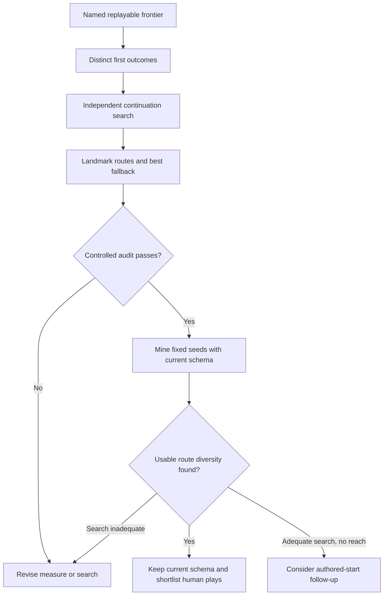
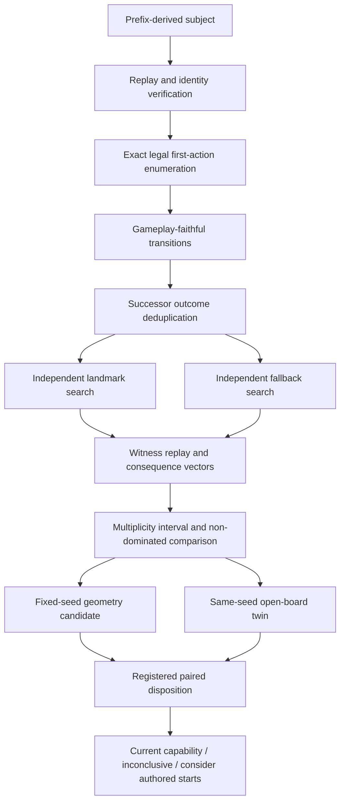
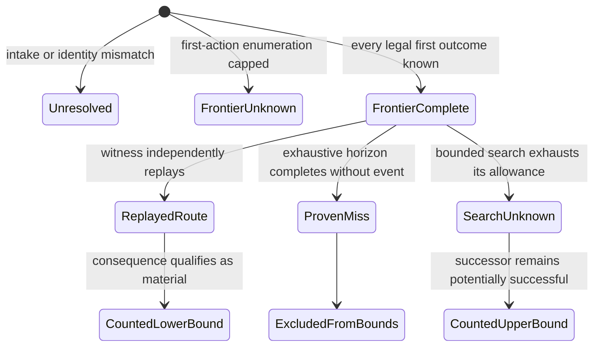

# Landmark Frontier Pre-Discovery - Plan

## Goal Capsule

- **Objective:** Give level authors evidence about whether the current game can produce multiple meaningful ways to reach important landmark tiles before the authoring system gains explicit starting-tile controls.
- **Means:** Audit named board states for distinct landmark routes and compare those routes with their best smaller fallback, then use fixed-seed mining with persistent geometry as the control.
- **Authority:** Repository rules and replay evidence establish what routes exist; the level author decides whether the alternatives feel meaningfully different in human play.
- **Open blockers:** None before implementation planning.
- **Stop condition:** Stop before adding authored starting tiles when the current-schema control has not completed or when bounded search cannot distinguish missing routes from insufficient search.

---

## Product Contract

### Summary

Build a pre-discovery audit for named 2048, 4096, or other landmark frontiers.
The implementation extends the bounded oracle and the repository's replay-verification patterns rather than adding a parallel search stack.
It measures materially different routes, their costs, and their aftermath, then tests whether fixed seeds plus existing geometry can produce the desired choice structure without expanding the level schema.

### Problem Frame

The owner repeatedly encounters positions where one more compatible tile would enable 2048.
Without it, the best available 1024 harvest can remove substantially fewer tiles, score less, and leave only one practical plan.
Legal-move count does not capture this problem because many chains can serve the same strategic route.

The current authoring genome varies dimensions, move budget, minimum chain, demand, and blockers.
It does not place exact starting tile values.
Adding 4096 anchors, bomb anchors, and off-lattice starting values now would mix several untested hypotheses and enlarge the search space before the project knows whether existing seeds and geometry are sufficient.

### Key Decisions

- **Audit before expanding authoring capability.** (session-settled: user-approved — chosen over adding authored starting tiles immediately: the control must distinguish a missing capability from insufficient search.) Governs R1-R17.
- **Use fixed-seed mining as the control.** (session-settled: user-approved — chosen over assuming the current schema cannot create landmark-route diversity: seeds and persistent geometry already exist.) Governs R12-R15.
- **Name each landmark per analysis.** (session-settled: user-approved — chosen over hard-coding 2048 globally: chapters and board states can make different values strategically relevant.) Governs R1, R2, and R17.
- **Keep structural evidence separate from experience judgment.** (session-settled: user-approved — chosen over treating route count as proof of fun: human play remains the final judge.) Governs R16 and R17.
- **Treat this as the first gate in the existing level MAP-Elites effort.** (session-settled: user-approved — chosen over creating a parallel authoring project: the result determines whether the current genome advances or needs revision.)

<!-- ce-section: work-relationships -->
### How This Work Fits Together

This plan covers the landmark-frontier pre-discovery slice of the broader level MAP-Elites authoring effort.
The surrounding areas remain separate decisions rather than implied follow-on requirements.

- **Enables:** descriptor qualification and later archive construction by testing whether the current genome can expose strategically different landmark frontiers.
- **May justify:** authored on-lattice starting layouts, but only after an adequate current-schema search fails its registered reach criterion.
- **Depends on later evidence:** off-lattice starting pieces require separate recovery-cost and player-readability support.
- **Can proceed independently of:** shipping new levels, changing scoring, or changing spawn rules.

### Requirements

**Audit subject and identity**

- R1. Each audit names one replayable board state, one landmark value, one move horizon, one objective, and the code identity used to evaluate it.
- R2. The audit accepts mid-game states as first-class subjects because landmark scarcity is not limited to the opening deal.
- R3. Reports preserve the originating level candidate, seed, move number, score, remaining moves, and exact board state.

**Route meaning and evidence**

- R4. The audit groups legal first moves by distinct successor outcome so reversals and other moves that create the same state count once.
- R5. Each distinct successor is searched independently for a replayable route that creates the named landmark within the stated horizon.
- R6. Each successor receives one evidence standing: replayed landmark route, proven miss when the search is exhaustive, or `UNKNOWN` when the bound is exhausted.
- R7. Route multiplicity reports a conservative lower bound and an upper bound that retains `UNKNOWN` successors as potentially successful.
- R8. Two routes count as materially different only when their first commitment or aftermath differs in consumed inventory, cleared cells, survivor position, or continued target viability.
- R9. The report exposes the replay witness and consequence fields for every route counted toward the lower bound.

**Landmark and fallback comparison**

- R10. For each audited frontier, the report compares the best-known landmark route with the best-known smaller fallback under the same objective and search bound.
- R11. The comparison keeps score, cells removed, survivor value and location, deliberately built inventory consumed or preserved, and continued target viability as separate fields.
- R12. The audit does not label a smaller fallback inferior solely because its immediate score or cleared-cell count is lower.

**Current-schema control**

- R13. Pre-discovery mines fixed seeds using only authoring controls accepted by the current schema.
- R14. A mined candidate qualifies as a diversity lead only when at least two materially different landmark routes have replay witnesses and neither is dominated on every recorded consequence.
- R15. Persistent geometry must carry the route consequence beyond the opening; an otherwise identical open-board comparison checks whether the special deal alone created the result.
- R16. Failed discovery under a bounded mining budget is reported as searched without discovery, not as proof that the current schema cannot produce the behavior.

**Authoring decision and handoff**

- R17. Every pre-discovery run ends with one disposition: current capability shows usable range, search adequacy remains inconclusive, or adequate search supports considering an authored-start extension.
- R18. The audit may nominate distant frontier examples for human play but may not certify fun, fairness, difficulty, or player preference.
- R19. This work does not modify game rules, scoring, spawning, shipped levels, the live bot, or the accepted level schema.

### Key Flow

- F1. Audit a named landmark frontier
  - **Trigger:** A level author selects a replayable state where a large-tile construction decision matters.
  - **Actors:** Level author and bounded analysis system.
  - **Steps:** Bind the subject identity; classify distinct first outcomes; search each continuation; compare replayed landmark routes with the best fallback; preserve `UNKNOWN` results.
  - **Outcome:** The author receives an inspectable account of how many distinct landmark plans are known and what each one costs.
  - **Covers:** R1-R12.

- F2. Test the current authoring capability
  - **Trigger:** The audit definition passes its controlled examples.
  - **Actors:** Level authoring search and level author.
  - **Steps:** Mine fixed seeds within the existing schema; retain persistent multi-route leads; compare them with open-board controls; classify the run using the registered disposition rule.
  - **Outcome:** The project knows whether to keep searching the current genome, revise the search, or consider authored starting layouts.
  - **Covers:** R13-R19.



### Acceptance Examples

- AE1. **Covers R4, R8.** Given two chains that produce the same successor state, when the frontier is audited, then they contribute one first-outcome class even if their drawn paths differ.
- AE2. **Covers R5, R8-R11.** Given two replayable routes to 2048 that consume different banks and leave the survivor in different locations, when both remain target-viable, then both count and their consequences appear separately.
- AE3. **Covers R10-R12.** Given one known 2048 route and a 1024 fallback that clears ten fewer cells, when the fallback preserves inventory needed by a later plan, then the report shows the tradeoff without declaring either route categorically better.
- AE4. **Covers R6, R7, R16.** Given a successor whose continuation search hits its cap without a witness, when multiplicity is reported, then the successor increases the upper bound but not the lower bound and remains `UNKNOWN`.
- AE5. **Covers R13-R17.** Given a fixed-seed candidate whose apparent multi-route opening disappears on the first refill, when the persistent-geometry control is applied, then the candidate is rejected as a diversity lead rather than used to justify the current genome.
- AE6. **Covers R17-R19.** Given an adequate current-schema search that fails the registered reach criterion, when the run closes, then the result may support a follow-up proposal for authored starts but does not add those controls or change a shipped level.

### Success Criteria

- Controlled fixtures distinguish a single practical route, two materially different routes, and cosmetic path variants that share one successor.
- Every route counted in a lower bound replays to the named landmark within the stated horizon.
- Every bounded miss remains visible as `UNKNOWN`, and every aggregate can be traced back to its per-successor evidence.
- The same frontier report makes the landmark-versus-fallback cost visible without collapsing consequence fields into one quality score.
- Fixed-seed mining produces a reproducible coverage report and one of the three R17 dispositions without changing the accepted schema.
- Human play candidates retain exact frontier identities so board traces and player accounts can test whether measured alternatives feel meaningfully different.

### Scope Boundaries

- Do not add authored 4096 tiles, bomb-valued tiles, off-lattice starting pieces, or arbitrary starting layouts.
- Do not change the spawn distribution, chain rules, scoring, target setting, blocker behavior, shipped levels, or live bot.
- Do not construct the full level MAP-Elites archive in this slice.
- Do not promote landmark-route multiplicity into a claim about fun, difficulty, fairness, or player skill.
- Do not treat an empty search result as an impossibility proof unless the named subject was searched exhaustively.

### Dependencies and Assumptions

- The analysis must be able to resume legal search from a named successor state rather than restarting from the initial board.
- Fixed-seed candidates and blocker geometry remain the current-schema control even though the generator does not treat seed as a mutable gene.
- The current evidence standard for exact results, replayed witnesses, bounded observations, and `UNKNOWN` outcomes remains authoritative.

### Sources and Research

- `docs/MEASUREMENT-AND-ANALYSIS-STANDARDS.md` defines the measurement layers, build-potential gap, and landmark-route multiplicity candidate.
- `EVIDENCE_LEDGER.md` records the accepted game rules, evidence boundaries, and correction that off-lattice values are recoverable.
- `prototypes/DESIGN-LEARNINGS.md` establishes build-and-harvest as the owner’s baseline and requires persistent decisions that survive refill.
- `prototypes/PLAYTEST-DECISION-LEDGER.md` records the retained Bank and Break family and the failure of opening-only or incidental-objective prototypes.
- `ideation/2026-09-11-missing-board-experiences-ideation.html` ranks the grounded authoring directions and preserves the rejected alternatives.
- `docs/plans/2026-09-16-2225-feat-level-map-elites-authoring-plan.md` supplies the broader authoring context and the existing deferral of authored starting tiles.

---

## Planning Contract

**Product Contract preservation:** unchanged.

### Key Technical Decisions

- KTD1. **Extend the bounded oracle instead of creating another continuation search.** Adopt the authoring oracle from `experiment/harvest-policy-corpus` at its preserved evidence standing, then add root-state and named-event seams behind its existing replay verifier. (session-settled: user-approved — chosen over relying on the live bot or building a parallel search stack: the oracle is the authoring instrument and must remain separate from shipped play.) Governs R5-R7, R10-R12, and R19.
- KTD2. **Admit production subjects only through prefix replay.** A subject identity binds the source candidate, seed, ordered prefix, full state, RNG cursor, landmark, fallback, horizon, objective, limits, and executable source hashes. Hand-built states remain test fixtures only. (session-settled: user-approved — chosen over accepting arbitrary board snapshots: future play depends on history and the refill stream, not visible tiles alone.) Governs R1-R3.
- KTD3. **Require a complete first-outcome frontier before publishing multiplicity.** Enumerate legal first actions exactly, apply the complete game transition, and deduplicate by successor identity. If enumeration hits its path-state cap, the frontier is `UNKNOWN` and no numeric interval is published. Governs R4 and R7.
- KTD4. **Separate exact misses from bounded misses.** An exhaustive continuation that completes the named horizon may return `proven_miss`; the bounded oracle may return only a replayed route or `UNKNOWN`. Each successor receives the same deterministic work allowance, while elapsed time is a safety cap that degrades only that successor to `UNKNOWN`. Governs R5-R7 and R16.
- KTD5. **Treat landmark and fallback as explicit first-creation events.** Every subject names `landmarkValue` and a smaller `fallbackValue`; neither may already exist at the root. A route succeeds only when its transition first creates exactly the named value and records the resulting location. (session-settled: user-approved — chosen over assuming every fallback is half the landmark or counting a pre-existing tile: each analysis defines the strategic frontier it is testing.) Governs R1, R5, R9-R12, and R17.
- KTD6. **Keep route consequences as an evidence vector.** Track first-commitment and named-event consequences separately, including lineage-backed built inventory, cells consumed, score, survivor value and location, and tri-state continued viability. Use the versioned objective only for best-known ordering; when it does not totally order routes, retain the non-dominated set. Governs R8-R12.
- KTD7. **Attribute diversity to geometry only through a paired open-board control.** Reuse the same initial deal and future draw stream, remove only blockers, and audit both arms independently. If the open twin retains the same material distinction or either arm is unresolved, the run cannot claim geometry support. (session-settled: user-approved — chosen over crediting any promising fixed deal to geometry: the control must distinguish a persistent authored effect from seed luck.) Governs R13-R16.
- KTD8. **Make the artifact independently reducible.** The verifier recomputes subject identities, source closure, first-outcome completeness, witness replays, consequence vectors, bounds, control pairing, and the final disposition from protocol-owned inputs rather than artifact-controlled expectations. Governs R3, R6-R9, and R13-R17.
- KTD9. **Register the mining decision before opening fresh seeds.** Controlled fixtures qualify the instrument first. A committed protocol then freezes the seed panel, current-schema ranges, landmark/fallback selection, limits, persistence rule, reach threshold, and disposition mapping before the reportable run. Governs R13-R17.

### High-Level Technical Design

The audit has one replay boundary and two search layers. Exact first-action enumeration establishes the denominator; independent continuation search establishes what is known about each successor.



Every result carries a standing that limits what downstream code may claim.



### Subject and Evidence Contracts

- **Subject contract:** Source candidate identity, seed, ordered prefix chains, move number, score, remaining moves, board state, blocker state, RNG draw cursor, landmark, fallback, horizon, objective identity, work limits, and source hashes.
- **Successor contract:** Full post-transition board, score, move count, draw cursor, blocker state, terminal state, and lineage state. Ordered chains that reach the same successor count once.
- **Route standing:** `replayed_landmark_route`, `proven_miss`, or `UNKNOWN`. A capped first frontier is a subject-level `UNKNOWN`, not a partial denominator.
- **Viability standing:** `replayed_viable`, `proven_not_viable`, or `UNKNOWN`. An unknown field cannot support Pareto dominance.
- **Run standing:** Verification failure is non-evidentiary and reduces to the inconclusive R17 disposition; it never becomes an adequate negative result.

### Output Structure

```text
solver/level-map/
└── landmark-frontier/
    ├── artifact.js
    ├── audit.js
    ├── cli.js
    ├── consequences.js
    ├── frontier.js
    ├── miner.js
    ├── subject.js
    └── transition.js
```

The oracle remains under `solver/oracle/`. Tests remain in `solver/tests/`, following the repository's current convention.

### Dependencies and Prerequisites

- The bounded oracle and evolved harvesting ranker currently end at `experiment/harvest-policy-corpus` commit `c88668d`. Their adoption must preserve RESULT-0041 as `UNVERIFIED` and add a separate owner decision for authoring use.
- The broader level MAP-Elites plan named in Sources is currently outside this worktree's tracked files. It must be restored as a repository artifact before downstream archive work uses this gate's disposition interface.
- `solver/engine.js` and `solver/level-author.js` remain unchanged because existing candidate receipts hash both files.
- `solver/exact-score.js`, `solver/trajectory-audit.js`, `solver/puzzle-descriptor-witness.js`, `solver/merge-spread-descriptors.js`, `solver/fixed-board.js`, and `solver/search-boards.js` provide the local enumeration, replay, lineage, and fixed-seed patterns.

### System-Wide Impact

- **Evidence lifecycle:** The gate adds a new source-bound artifact and verifier. It does not change the standing of existing experiments or candidate receipts.
- **Compute:** Exact first-action enumeration may dominate cost before continuation search begins. The miner must preserve capped and unresolved denominators rather than silently selecting easy boards.
- **Authoring workflow:** A supported result keeps the current schema in play. An adequate negative result permits a separate authored-start proposal but does not implement it.
- **Human review:** The output may nominate frontier states for play. It cannot certify that the measured alternatives feel different.

### Alternatives Considered

- **Extend `solver/forced-diversity-descriptors.js`.** Rejected because it counts ordered opening chains, searches one shared bounded beam, and targets score rather than distinct successor outcomes and named landmark events.
- **Build a second landmark-only beam search.** Rejected because the bounded oracle already owns authoring search, work accounting, and independent witness replay.
- **Use bounded opening candidates for the denominator.** Rejected because an unseen first outcome makes the numeric upper bound unknowable.
- **Rank routes with one weighted quality score.** Rejected because survivor position, built inventory, and continued viability are not safely commensurable.
- **Add authored starts now.** Deferred by the Product Contract until the current-schema control reaches a registered disposition.

### Risk Analysis and Mitigation

| Risk | Consequence | Mitigation |
| --- | --- | --- |
| Exact first-action enumeration exceeds practical limits | The audit selects only sparse boards or reports little numeric coverage | Price enumeration during fixture qualification, report capped frontiers separately, and stop before changing the denominator definition |
| Oracle adoption rewrites historical experiment standing | Authoring use appears to validate an unverified experiment | Preserve RESULT-0041 and record a separate owner decision tied to the adopted code identity |
| The analysis transition drifts from game behavior | Replayed routes are false evidence | Mirror the full execute, gravity, refill, blocker-tick, and terminal lifecycle and test parity across stone, ice, bomb, and ordinary states |
| Lineage instrumentation changes game outcomes | Consequence vectors describe a different game | Keep lineage as metadata on cloned analysis states and assert state equality after removing metadata |
| One successor consumes the shared search budget | Route count depends on iteration order | Allocate identical deterministic work limits per successor and treat wall-clock limits as fail-closed safety caps |
| The open-board twin is not truly paired | Geometry attribution is confounded by different deals or future refills | Bind both arms to one deal and future stream identity, then verify those identities independently |
| A promising developmental sample becomes a claim | Thresholds and seed panels overfit observed outcomes | Separate controlled qualification, exploratory pricing, and the preregistered fresh run |
| A clean structural result still feels ordinary | Authoring advances on a proxy that misses experience | Preserve the human-play boundary and nominate exact frontier states rather than promoting levels automatically |

---

## Implementation Units

### U1. Adopt the bounded oracle for authoring continuation

- **Goal:** Establish the existing oracle as the single bounded continuation engine for the landmark gate.
- **Requirements:** R5-R7, R10-R12, R19
- **Dependencies:** None
- **Files:** `solver/oracle/search.js`, `solver/oracle/simulation.js`, `solver/oracle/verify.js`, `solver/tests/oracle.test.js`, `solver/tests/harvestPolicy.test.js`, `EVIDENCE_LEDGER.md`
- **Approach:** Land the oracle dependency at its preserved source identity, then add a verified root-state entry and a named event objective under KTD1 and KTD4. Keep level-and-seed search as a wrapper so the captured oracle corpus remains replayable.
- **Execution note:** Characterize the adopted branch behavior before adding the continuation seam.
- **Patterns to follow:** Independent engine replay in `solver/oracle/verify.js`; append-only owner decisions in `EVIDENCE_LEDGER.md`.
- **Test scenarios:**
  - A level-and-seed root and the equivalent verified root-state input return the same best-known witness under the same deterministic work cap.
  - A root-state input with a changed score, move count, draw cursor, board, or source identity is rejected before search.
  - A named event objective stops on the transition that first creates exactly the requested value and records its location.
  - A bounded miss remains `UNKNOWN`; it cannot become `proven_miss`.
  - The pre-adoption oracle fixtures and harvest-policy tests retain their recorded behavior.
- **Verification:** The adopted oracle replays its existing corpus, accepts an identity-bound continuation root, and exposes named-event search without changing the shipped bot.

### U2. Establish replayable frontier subjects and faithful transitions

- **Goal:** Turn recorded prefixes into verified mid-game subjects whose future refill stream and blocker state are reproducible.
- **Requirements:** R1-R3, R9, R19; F1
- **Dependencies:** U1
- **Files:** `solver/level-map/landmark-frontier/subject.js`, `solver/level-map/landmark-frontier/transition.js`, `solver/tests/landmarkFrontierSubject.test.js`
- **Approach:** Resolve production subjects through candidate and session identities, replay their prefixes, compare every claimed field, and construct the KTD2 subject identity. Implement the full analysis transition outside the hash-bound engine and attach non-behavioral lineage metadata for KTD6.
- **Execution note:** Build the parity and tamper tests before accepting a serialized subject.
- **Patterns to follow:** Prefix reconstruction and RNG tracking in `solver/trajectory-audit.js`; session identities in `solver/record-session.js`; merge lineage in `solver/merge-spread-descriptors.js`.
- **Test scenarios:**
  - A recorded prefix reproduces the submitted board, score, remaining moves, blocker state, and RNG cursor.
  - Changing one prefix chain, tile value, blocker timer, score, or cursor makes the subject unresolved.
  - A hand-built state is accepted by fixture helpers but rejected by the production artifact loader.
  - Ordinary, stone, thawing-ice, and expiring-bomb transitions match the engine after lineage metadata is removed.
  - A transition that creates the landmark records the post-transition survivor location; a larger result or pre-existing landmark does not satisfy the event.
- **Verification:** Every production subject can be independently reconstructed from its source prefix, and the analysis transition is behaviorally identical to the engine on controlled lifecycle fixtures.

### U3. Enumerate and deduplicate the first-outcome frontier

- **Goal:** Establish the complete set of distinct first commitments that supplies the audit denominator.
- **Requirements:** R4, R7-R9; F1; AE1, AE4
- **Dependencies:** U2
- **Files:** `solver/level-map/landmark-frontier/frontier.js`, `solver/tests/landmarkFrontierAudit.test.js`
- **Approach:** Enumerate legal chains through the exact action enumerator, apply U2 transitions, and group actions by the KTD3 successor contract. Retain representative chains for replay while counting successor outcomes.
- **Execution note:** Implement the complete, duplicate, and capped fixtures before using real board states.
- **Patterns to follow:** `enumerateLegalChainsWithStats()` and its deterministic cap in `solver/exact-score.js`; survivor-sensitive enumeration tests in `solver/tests/exact-score.test.js`.
- **Test scenarios:**
  - Covers AE1. Reversed or reordered chains that reach the same complete successor contribute one outcome class.
  - Equal-score chains that leave survivors in different locations remain different outcome classes.
  - Actions that produce the same visible board but differ in score, move count, RNG cursor, blocker state, or lineage remain different outcomes.
  - A completed enumeration with no legal move returns an empty complete frontier rather than a capped frontier.
  - Covers AE4. Hitting the path-state cap returns `UNKNOWN` diagnostics and no numeric multiplicity interval.
- **Verification:** The frontier reports a numeric denominator only after exact enumeration completes, and every retained outcome replays from the verified subject.

### U4. Search and verify landmark and fallback routes

- **Goal:** Give each distinct successor independent evidence for the named landmark and smaller fallback.
- **Requirements:** R5-R7, R9-R12; F1; AE2-AE4
- **Dependencies:** U1, U3
- **Files:** `solver/level-map/landmark-frontier/audit.js`, `solver/level-map/landmark-frontier/artifact.js`, `solver/oracle/search.js`, `solver/oracle/verify.js`, `solver/tests/landmarkFrontierAudit.test.js`
- **Approach:** Run landmark and fallback objectives from each successor under identical per-successor limits. Preserve exact and bounded standings under KTD4, then replay every witness through the independent verifier before it can affect an aggregate.
- **Execution note:** Prove the public verifier red with a mutated witness before trusting the successful fixture.
- **Patterns to follow:** Fail-closed witness replay in `solver/puzzle-descriptor-witness.js`; per-position capped search semantics in `solver/trajectory-audit.js`.
- **Test scenarios:**
  - Covers AE2. Two successors with different consumed inventory and survivor locations independently replay to the landmark within the horizon.
  - An exhaustive finite fixture with no landmark route returns `proven_miss`.
  - A beam or candidate-capped miss returns `UNKNOWN`, including when an elapsed-time safety cap fires.
  - Each successor receives the same deterministic work allowance regardless of enumeration order.
  - A changed chain coordinate, named value, spawn cursor, source identity, or reported event location causes witness verification to fail.
  - Landmark and fallback searches use the same root, horizon, objective identity, and limits.
- **Verification:** Every successful successor has an independently replayed first-creation witness, every exact miss carries completeness evidence, and every bounded miss remains visible as `UNKNOWN`.

### U5. Report material routes and landmark-versus-fallback tradeoffs

- **Goal:** Reduce verified per-successor evidence into an inspectable multiplicity interval and consequence comparison without inventing a composite quality score.
- **Requirements:** R7-R12, R17-R18; F1; AE2-AE4, AE6
- **Dependencies:** U2-U4
- **Files:** `solver/level-map/landmark-frontier/consequences.js`, `solver/level-map/landmark-frontier/artifact.js`, `solver/level-map/landmark-frontier/cli.js`, `solver/tests/landmarkFrontierArtifact.test.js`
- **Approach:** Compute KTD6 consequence vectors at the first commitment and named event, group materially distinct successful successor classes, and retain the versioned objective's winner or non-dominated set. Recompute bounds and dispositions from verified rows in the public artifact verifier.
- **Patterns to follow:** Source-bound artifact reduction in `experiments/RESULT-0035/verify.js`; proof-standing vocabulary in `EVIDENCE_LEDGER.md`.
- **Test scenarios:**
  - The lower bound counts only replayed, materially distinct landmark successors; the upper bound adds known `UNKNOWN` successors.
  - Exact misses affect the denominator but neither bound numerator.
  - Covers AE3. A fallback that clears fewer cells but preserves built inventory remains incomparable rather than being labeled categorically worse.
  - An `UNKNOWN` continued-viability field prevents dominance but remains visible in the report.
  - A comparator that produces a tie returns a non-dominated set rather than an arbitrary representative.
  - Covers AE6. An invalid or unverifiable run reduces to the inconclusive disposition and cannot recommend authored starts.
- **Verification:** The verifier reconstructs every aggregate from traceable successor rows, and the CLI emits the same canonical artifact for the same subject and configuration.

### U6. Mine fixed seeds with a paired open-board control

- **Goal:** Determine whether current-schema seeds and persistent geometry can produce usable landmark-route diversity.
- **Requirements:** R13-R19; F2; AE5, AE6
- **Dependencies:** U5
- **Files:** `solver/level-map/landmark-frontier/miner.js`, `solver/level-map/landmark-frontier/cli.js`, `solver/tests/landmarkFrontierMiner.test.js`, `solver/tests/landmarkFrontierCli.test.js`
- **Approach:** Sample or accept only current-schema shapes, treat seed as the external board dimension, and build same-stream geometry/open twins under KTD7. Preserve every screened, capped, rejected, and qualifying denominator so the miner cannot report only cheap successes.
- **Execution note:** Start with a deterministic miniature search containing a true geometry lead, a seed-only false positive, and a capped frontier.
- **Patterns to follow:** Shape sampling in `solver/generate-levels.js`; fixed-board identity and verification in `solver/fixed-board.js`; seed traversal in `solver/search-boards.js`.
- **Test scenarios:**
  - Every mined geometry candidate passes the existing shape validator without adding a starting-tile field.
  - Geometry and open twins share the initial deal and future stream identities while differing only in blockers.
  - Covers AE5. A multi-route opening whose distinction disappears after refill is rejected as a lead.
  - A geometry arm with two replayed non-dominated routes and an open twin without the same distinction qualifies under the controlled fixture rule.
  - An open twin with the same distinction prevents geometry attribution but does not erase the candidate's structural observation.
  - Any unresolved arm makes the pair inconclusive, and changing seed order does not change per-seed artifacts.
- **Verification:** Repeating a mining configuration reproduces its candidates, twins, denominators, and provisional dispositions without changing the accepted level schema.

### U7. Register and close the current-schema pre-discovery run

- **Goal:** Produce one honest decision about whether current authoring controls show usable range, remain inconclusive, or justify considering authored starts.
- **Requirements:** R13-R19; F2; AE5, AE6
- **Dependencies:** U1-U6
- **Files:** `experiments/RESULT-0042/protocol.md`, `experiments/RESULT-0042/subject.js`, `experiments/RESULT-0042/run.js`, `experiments/RESULT-0042/verify.js`, `experiments/RESULT-0042/run.test.js`, `experiments/RESULT-0042/report.md`, `EVIDENCE_LEDGER.md`, `CURRENT.md`
- **Approach:** Qualify the instrument on controlled fixtures, then commit the KTD9 protocol before opening fresh seeds. The verifier owns expected panels, source closure, limits, pairing, reach thresholds, and disposition reduction; the artifact supplies observations only.
- **Execution note:** Plant and observe failing twins for a substituted seed panel, changed work limit, missing witness, wrong route count, omitted dependency, and forged disposition before the reportable run.
- **Patterns to follow:** Registration and source closure in experiments `RESULT-0033` through `RESULT-0035`; corrected verifier boundaries documented by `CORRECTION-0007` in `EVIDENCE_LEDGER.md`.
- **Test scenarios:**
  - A protocol committed after any outcome artifact is rejected as a reconstruction.
  - Development, qualification, calibration, candidate-holdout, and reportable seed ranges cannot overlap.
  - The verifier rejects a coherently substituted seed panel even when the artifact rehashes itself.
  - The verifier rejects changed node, path-state, action, horizon, or persistence limits.
  - Covers AE6. Only an independently verified adequate negative run may support considering authored starts; every invalid or underpowered run remains inconclusive.
  - Human-play nominations retain exact frontier identities but do not change the machine disposition.
- **Verification:** The experiment gate admits the registered protocol, the public verifier recomputes the result, and the ledger records the exact proof class without promoting structural evidence into a gameplay claim.

---

## Verification Contract

| Verification layer | Applies to | Required outcome |
| --- | --- | --- |
| Subject and transition tests | U2 | Prefix replay, RNG cursor, blocker lifecycle, landmark event, and lineage parity pass; at least one tampered subject is observed failing before the final green run |
| Frontier and audit tests | U3-U5 | `node --test solver/tests/landmarkFrontierSubject.test.js solver/tests/landmarkFrontierAudit.test.js solver/tests/landmarkFrontierArtifact.test.js` passes controlled one-route, two-route, duplicate, exact-miss, and capped cases |
| Mining tests | U6 | `node --test solver/tests/landmarkFrontierMiner.test.js solver/tests/landmarkFrontierCli.test.js` passes the geometry lead, seed-only false positive, unresolved twin, and deterministic replay cases |
| Oracle regression | U1, U4 | `node --test solver/tests/oracle.test.js solver/tests/harvestPolicy.test.js` preserves the adopted oracle corpus behavior and independently rejects a planted illegal witness |
| Local compatibility | U1-U6 | `node --test solver/tests/exact-score.test.js solver/tests/puzzleDescriptorWitness.test.js solver/tests/forcedDiversityDescriptors.test.js solver/tests/fixedBoard.test.js solver/tests/generateLevels.test.js` retains the existing enumeration, cap, fixed-board, and generator contracts |
| Receipt preservation | U1-U7 | `solver/engine.js` and `solver/level-author.js` remain byte-identical, so existing candidate receipt identities do not change |
| Experiment admission | U7 | `node tools/verify-experiments.js` recognizes the committed protocol and rejects changed panels, source closure, work limits, witnesses, and disposition inputs |
| Repository baseline | U1-U7 | `node --test solver/tests/*.test.js` retains the documented baseline of 420 tests: 415 passing, four deliberate failures, and one skip; the known failures are not re-authored or exempted |
| Product boundary | U7 | The report emits one R17 disposition, preserves `UNKNOWN`, and leaves fun, fairness, difficulty, and player preference to separately identified human play |

---

## Definition of Done

- The Product Contract remains unchanged in meaning, and every implementation-facing rule is owned by one KTD or R-ID.
- The oracle is available to authoring from verified continuation roots without replacing the live bot or rewriting RESULT-0041.
- Every production frontier subject derives from a replayed prefix and binds the future refill stream, blocker state, objective, limits, and executable source closure.
- Exact first-outcome enumeration either completes or returns a subject-level `UNKNOWN`; partial frontiers never produce numeric multiplicity.
- Every counted route independently replays the exact named-value creation event, and every exact or bounded miss retains the correct evidence standing.
- Landmark and fallback reports preserve consequence vectors, lineage, non-dominated alternatives, and tri-state continued viability.
- Fixed-seed mining uses only accepted authoring controls, pairs each geometry candidate with a same-stream open twin, and retains all screened and unresolved denominators.
- A committed RESULT-0042 protocol precedes fresh mining outcomes, and its verifier is proven red against crafted bad artifacts before the reportable run.
- The final evidence record states one permitted disposition without promoting structural evidence into a claim about human experience.
- Abandoned experimental modules, duplicate search paths, temporary artifacts, and dead fixtures are removed before the implementation is declared complete.
