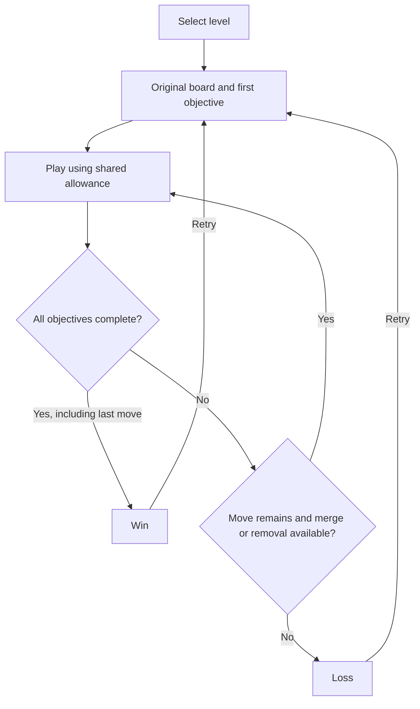
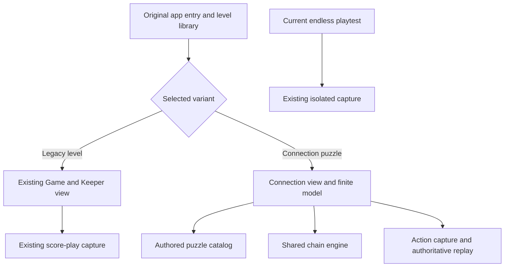
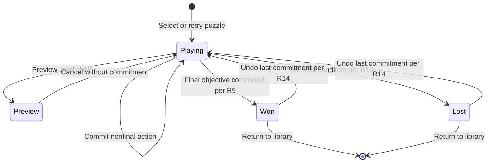

# Connection Puzzle Levels - Plan

## Goal Capsule

- **Objective:** Players can beat and retry Connection puzzles within their existing tile game.
- **Means:** The retained Connection Run + Power-up loop becomes a level variant in the original app, following KTD1-KTD3.
- **Product authority:** PDL-030 confirms finite-puzzle behavior; PDL-031 clarifies the original-game destination; PDL-032 records the prototype visual preference.
- **Execution profile:** The current request authorizes planning progress while the owner plays the unchanged prototype. This document describes later implementation, not authority to begin integration, publish, commit or open a PR.
- **Stop conditions:** Keep the live playtest untouched. Stop for owner direction if execution would change settled gameplay, legacy progression or the product destination.
- **Completion ownership:** An implementer supplies the checks in Verification Contract; the owner judges puzzle quality and approves integration after play.

---

## Product Contract

### Summary

Add the confirmed first pack of independent Connection puzzles as a level variant in the original tile-game app.
Keep the earned-removal loop, give each attempt a repeatable finish, and carry the preferred prototype look into the Connections view.
The implementation preserves legacy score levels and the current endless playtest; it does not establish a new campaign or redesign every screen.

### Problem Frame

The owner reports enjoying the competing demands of growing the board, completing connections and building a large tile for removal credit.
Charges are difficult to accumulate, making saved inventory valuable.
The endless run has no finite victory, and the owner wants the satisfaction of beating a particular puzzle.
Both separate puzzles and same-board chapters appeal to them, but separate puzzles are their personal priority.
These are conversation reports, not measured balance or endurance results; PDL-029 preserves the feedback.
The standalone playtests were never connected to the original app's level system, and later wording obscured that separation.
The owner has now clarified the destination and the preferred visual reference.

### Key Decisions

- **Independent puzzles first.** Give the owner distinct challenges they can beat and learn on retry. Governs R1, R8. (session-settled: user-directed — chosen over same-board chapters: separate puzzles were the owner's personal preference.)
- **Efficiency is part of the challenge.** Use a bounded attempt rather than continuing until the board locks. Governs R5. (session-settled: user-directed — chosen over no move limit: the owner selected move-budget pressure.)
- **Removal has an opportunity cost.** Spending recovery can improve the board while reducing the allowance available for connections. Governs R5. (session-settled: user-directed — chosen over free removal: the owner retained the one-move cost under the hard budget.)
- **A small authored pack, not a campaign.** The confirmed first scope is intended for owner play and revision. Governs R1, R12.
- **Independent starting inventory and repeatable attempts.** Prevent earlier stockpiles or a fresh random deal from changing the puzzle being retried. Governs R7, R8.
- **A variant in the original game.** The owner affirmed original-game level variants over a separate product. Governs R16. (session-settled: user-approved — chosen over keeping a separate game: the existing game is the intended destination.)
- **Prototype visuals are the reference.** The owner prefers this prototype's visual design over the original 2248 presentation. Governs R17; this preference does not select a whole-game redesign.

### Requirements

**Puzzle identity and objectives**

- R1. Provide three separate levels, each with a designed starting board and an ordered sequence of three fixed connection objectives.
- R2. Show only the current objective's board markers and exact conditions, advancing to the next only when it is completed.
- R3. Preserve ordinary chain, survivor placement, gravity and refill behavior from [Connection Run](../../prototypes/connections-continuous/README.md), without restricting otherwise legal moves to objective progress.
- R4. A connection is completed only by a legal chain matching its designated endpoints and exact resulting value.

**Budget, recovery and outcomes**

- R5. Give each level one fixed shared allowance for merges and removals; committing either requires and spends one remaining move.
- R6. Preserve the earning, capacity, chosen-tile removal and no-score/no-objective-completion behavior of the existing [power-up play contract](../../prototypes/connections-powerup/README.md), except for the level boundaries in R7 and budget in R5.
- R7. Start every level with zero charges and retain earned charges between its objectives, without carrying inventory into another level.
- R8. Retry restores the identical starting board, ordered objectives, refill sequence and move allowance, with inventory reset per R7.
- R9. Winning requires completion of the sequence in R1 within R5; completing the final objective on the last available move is a win.
- R10. An unfinished attempt loses when no moves remain or when neither a legal merge nor an earned removal is available; the absence of a merge alone is not a loss while removal remains usable.
- R11. Do not allow objective skipping or board redealing to advance an attempt; replacing its board requires retry under R8.

**Player controls and preservation**

- R12. Let the player choose a level, retry it and move to another level after the result, without requiring campaign unlocks for this first playtest.
- R13. Show the current level, completed-objective count, remaining moves and actual charge bank alongside the existing board and arithmetic aids.
- R14. Preserve free preview, cancellation and undo, with undo restoring board, objective progress, refill position, bank and remaining allowance together.
- R15. Leave all existing endless-mode and Delivery play, rules and captures unchanged.

**Original-game destination and live-play safety**

- R16. Make the finite Connections pack accessible as a level variant from the original game's app, preserving existing score-level definitions, numbering and unlock progress.
- R17. Use the Connections prototype's visual design as the reference for its integrated view, including the single-objective panel and visible chain arithmetic.
- R18. Leave the owner's current Connections playtest runtime, server and session intact throughout preparation; present a later integrated preview without replacing that running game.

### Key Flows

- F1. Start a puzzle. **Covers R1, R2, R7, R12, R13.** The player selects a level and sees its original board, first objective and full allowance.
- F2. Balance growth and progress. **Covers R2-R6, R13, R14.** Ordinary merges can build material or complete the active objective; preview is free, and the player may earn and save removal credit.
- F3. Spend recovery. **Covers R5-R7, R10, R14.** The player chooses a tile, spends a charge and a move, and receives normal gravity/refill without objective completion from that removal.
- F4. Finish or retry. **Covers R8-R12, R14.** Completion of the sequence produces a win; an exhausted allowance or no available merge/removal produces a loss while objectives remain; retry recreates the same puzzle.
- F5. Choose the variant. **Covers R12, R16, R17.** Enter Connections from the original app's level navigation, choose a puzzle and return to legacy levels without changing their unlock state.

The play surface retains the existing board and single-objective panel.
R13 adds level-wide progress and allowance information; result controls offer retry or another level rather than an in-attempt fresh deal.
The Connections view follows R17; exact control placement is implementation work.
The original game's other screens are not automatically restyled.

### Acceptance Examples

- AE1. **Covers R2-R4.** A legal growth merge that misses the active connection remains playable and does not advance the objective.
- AE2. **Covers R5-R7.** A qualifying merge earns according to the bound play contract; spending its credit later also reduces the remaining allowance by one.
- AE3. **Covers R5, R6, R10.** With one move and one charge remaining but no legal merge, a removal remains usable; if objectives remain unfinished afterward, the exhausted attempt loses.
- AE4. **Covers R5, R9, R10.** Completing objective three on the last move wins, even if the resulting board has no legal action.
- AE5. **Covers R7, R8, R12.** Retry or selection of another level starts with an empty bank; repeating the same choices on retry encounters the same refills and objectives.
- AE6. **Covers R5, R6, R14.** An unearned removal cannot spend a move, preview cannot grant real inventory, and undo restores the pre-action allowance and bank.
- AE7. **Covers R2, R11.** Skipping an inconvenient objective or requesting a new board cannot count toward the three required completions.
- AE8. **Covers R12, R16.** A player with existing score-level unlock progress enters a freely selectable Connection puzzle and returns with that progress unchanged.
- AE9. **Covers R15, R18.** Preparing or serving the integrated preview does not change the rules identity or state of the owner's running endless playtest.

### Success Criteria

Each level has a replayable winning route within its chosen allowance before owner play.
Feasibility is not a shortest-route, difficulty or enjoyment result.

The pack tests alignment, preserving useful material and balancing growth against objective progress.
At least one level makes earning and spending a removal meaningfully useful, rather than offering a bonus that arrives after the puzzle is already finished.
Budgets should permit different credible plans instead of requiring the player to imitate one exact hidden route.

Owner play determines whether wins feel earned, losses make a better plan discoverable, and the growth/objective/recovery balance survives the finite format.
No level is claimed to achieve those qualities merely because a witness succeeds.

### Scope Boundaries

- Same-board chapters are deferred, not rejected.
- A full campaign, unlock economy, stars, leaderboards and new power-ups are outside this first pack.
- No retuning of the earning threshold or bank capacity is included.
- No new archetype quota, Delivery revision or live-bot comparison is included.
- Release and adoption on the protected main branch require later verification and owner review; this planning pass does neither.
- The whole original interface is not redesigned by R17. Delivery remains a retained candidate, not another implementation unit in this pack.
- Native browser/touch QA and independent review remain separate completion work; earlier prototype checks do not establish this mode's readiness.

### Dependencies and Assumptions

The existing power-up mode supplies the retained recovery behavior per R6.
Its unlimited-run balance does not demonstrate suitability under R5; the finite pack needs its own feasibility checks and owner play.
The confirmed starting-inventory and retry defaults are part of this first playtest, not measured balance settings.

### Outstanding Questions

- **Deferred to implementation:** U2 authors concrete boards, conditions and move allowances through replay and shortcut checks. This plan does not claim to have resolved them.
- **Deferred to owner play:** Does the proposed three-puzzle learning sequence preserve the growth/objective/recovery balance under a finite allowance?
- **Deferred to follow-up:** Where should Connections and Delivery appear in a full mixed campaign, and how should they unlock? The first pack follows R12 without replacing legacy progression.
- **Deferred to follow-up:** Should the preferred visual treatment extend to every original-game screen? R17 covers the Connections view only.

### Sources

- [PDL-029 and PDL-030](../../prototypes/PLAYTEST-DECISION-LEDGER.md): owner enjoyment, missing finish line, mode preference and confirmed scope.
- [Connection Run + Power-up](../../prototypes/connections-powerup/README.md): authority bound by R6; this brief changes level boundaries and budget, not earning or removal effects.
- [Connection Run](../../prototypes/connections-continuous/README.md): ordinary behavior bound by R3; perpetual objective issuance is replaced by R1-R2.
- [Delivery authoring guide](../game-design/levels/delivery-authoring-guide.md): prior lessons on obvious ladders, placement consequences and leaving room to compare plans.
- [Current workbench](../game-design/levels/archetype-workbench.md): retained references and the superseded archetype quota.

---

## Planning Contract

**Product Contract preservation:** R1-R15 unchanged. Added R16-R18 and F5/AE8/AE9 for the owner's integration, visual and live-play clarifications; no prior gameplay choice was reopened.

### Key Technical Decisions

- KTD1. **One app entry, variant-specific controllers.** Extend `src/index.html` with a library entry and conditional boot through a new `src/game-library.js`. Legacy selection loads the existing `game.js` and Keeper presentation; Connections loads its own model and view in the same app. `Game.checkWinLose` is score-target-specific, so routing is smaller than making it own two incompatible outcome systems. Governs R16; does not add another standalone product.
- KTD2. **Keep protected core files byte-for-byte unchanged.** Implement the Connections model in new source modules using `solver/engine.js` through the existing browser-wrapper pattern in `prototypes/archetype-trio/serve.js`. Do not edit `src/game.js`, `solver/engine.js` or `solver/level-author.js`. Their historical receipts bind source bytes; app-entry changes need compatibility coverage instead of unnecessary receipt regeneration.
- KTD3. **Fixed puzzle data, not dynamic objective issuance.** Store stable puzzle IDs, starting grids, refill seeds, allowances and ordered conditions in `src/connection-levels.js`. A dedicated `src/connection-rules.js` owns the finite state machine. The continuous model's `issue` can select new goals after a merge, so it is a behavior reference rather than the finite runtime. Implements R1, R2, R5, R7, R8.
- KTD4. **Treat Connections actions as their own capture contract.** Add a replay-validated endpoint and separate storage for merge, removal and undo actions. The existing `/api/play-sessions` schema records scored chains and numeric levels; it cannot faithfully represent this variant. Preserve that endpoint and old captures instead of assigning Connections fake score-level numbers.
- KTD5. **Extract behavior without changing the live prototype.** New app modules must not import mutable `prototypes/` runtime files. Use the retained models, combinations helper, styles and actual-page test pattern as references; characterize their adopted behavior before implementing the finite deltas. R15 and R18 govern preservation.

### High-Level Technical Design

KTD1 prevents both controllers from starting on one page.
The legacy route retains the existing query behavior, including `level`, `seed`, `candidate` and Keeper study flags.
Connection saves bind the puzzle definition and runtime identity before replay; the browser's reported final state is not authoritative.

### Assumptions

These are planning proposals, not additional owner-confirmed gameplay decisions.

- The first pack appears as a Connections category in the original app's library, rather than being inserted between existing numbered score levels. This is reversible and follows R12/R16 without selecting a final campaign order.
- The three puzzles use the teaching sequence below. Their actual difficulty is unknown until authored and played.
- Legacy screens retain their current presentation during the first integration; R17 guides the Connections view rather than authorizing a theme-wide replacement.
- Completion records for Connection puzzle IDs use a separate storage key from `unlockedLevel`. No stored legacy progress is migrated or renumbered.

### First-Pack Authoring Direction

| Puzzle | Skill to practice | Board consequence to inspect |
| --- | --- | --- |
| 1. Arrange a connection | Learn how gravity and the survivor position prepare an exact path | A productive growth merge must still leave the required endpoint route reachable |
| 2. Preserve for later | Complete the current goal while retaining useful material for the next | An attractive immediate completion must have a visible downstream material cost |
| 3. Grow and recover | Balance connection progress against earning and spending recovery | A removal should become useful before the puzzle is already effectively finished |

PDL-008 establishes build-and-harvest as the owner's baseline, not a new strategy.
U2 must name an actual candidate board state where choosing which material to retain, which endpoint to use or when to spend recovery changes that baseline choice.
The table does not prescribe a hidden solution or guarantee increasing difficulty.
Apply the design guide's teach/practice/pressure rhythm; do not manufacture progression by uniformly inflating numbers.

### Risks and Boundaries

- A finite allowance may make the retained earning threshold arrive too late. Author the board and budget to test R6; do not silently lower the threshold or supply starting charges.
- The current continuous model can lose a chain-only state while retaining removal access. The finite model must resolve R9/R10 after objective and charge updates, with final completion taking precedence.
- `keeper-motion-prototype.js` overrides the legacy renderer through `window.game`. It must not run on the Connections route.
- Sharing the original app is not sharing its legacy capture schema. KTD4 protects both stores from incompatible replay data.
- Campaign unlocks, a generic multi-mechanic framework, bot retuning and the existing prototype-collector repair are not built in this slice. A later consumer requirement or measured failure could justify them.

### Research Basis

- `src/game.js`: `startBrowserGame`, `validatePlayableLevel`, `Game.checkWinLose`, `nextLevel` and `AuthoringCapture` establish the legacy boot, score objective, progress key and capture boundaries.
- `src/index.html`, `src/keeper-motion-prototype.js`: original app entry and renderer override.
- `tools/play-server.js`: same-origin static delivery and the existing score-session endpoint.
- `prototypes/connections-continuous/model.js`, `prototypes/connections-powerup/model.js`: retained matching, transition, reward, removal and replay behavior.
- `prototypes/connections-powerup/app.test.js`: actual HTML/script loading, with rendering and native touch explicitly outside its proof.
- `docs/game-design/levels/difficulty-and-progression.md`: progression guidance, not evidence that this pack is calibrated.
- `docs/solutions/tooling-decisions/evolving-bounded-game-heuristics-with-proof-carrying-evaluation.md`: replay legality and fixed paired inputs remain outside mutable search policy. No policy-search work is included.

---

## Implementation Units

### U1. Build the finite Connections model

**Goal:** A deterministic model implements the approved puzzle and recovery lifecycle.

**Requirements:** R1-R11, R14; F2-F4; KTD2, KTD3, KTD5.

**Dependencies:** None; use small test puzzle definitions before U2's final content.

**Files:** Add `src/connection-rules.js`, `solver/tests/connectionRules.test.js`.

**Approach:**

1. Characterize the retained ordinary transitions and recovery behavior against the actual prototype model.
2. Implement the finite state and action replay against supplied puzzle definitions using KTD3.
3. Evaluate completion and terminal conditions after each commitment; keep previews immutable and restore the full state on undo.

**Patterns to follow:** Shared engine transitions; the retained power-up model's copying and authoritative replay.

**Execution note:** Establish failing behavior checks against real modules before implementing the finite deltas.

**Test scenarios:**

- Covers AE1. A legal nonobjective growth merge changes the board without advancing the goal.
- Covers AE2/AE6. A qualifying committed merge awards according to R6, while preview leaves the source state and bank unchanged.
- Covers AE3. With one move, one charge and no legal chain, removal is available; exhaustion afterward loses if a goal remains.
- Covers AE4. Final completion on the last move wins even when no further action is possible.
- Covers AE5. Identical retry actions reproduce grid, objective, refill cursor and empty starting bank.
- Covers AE6. Undo after removal or completion restores objective, bank, allowance, RNG cursor and outcome together.
- Covers AE7. Replay rejects skip, redeal, unearned removal and commitments after termination.

**Verification:** The model checks read the implemented module and adopt the retained behavior without changing prototype bytes.

### U2. Author and qualify the first three puzzles

**Goal:** Three distinct, replayable puzzles express the proposed teaching sequence.

**Requirements:** R1-R4, R5-R9; Success Criteria; KTD3.

**Dependencies:** U1.

**Files:** Add `src/connection-levels.js`, `solver/tests/connectionLevels.test.js`, `tools/author-connection-levels.js`; preserve private witness artifacts under `docs/game-design/levels/connection-pack/`.

**Approach:**

1. Author the fixed layouts and ordered conditions with the baseline-choice requirement in First-Pack Authoring Direction.
2. Replay whole-level winning traces before selecting allowances; objective-by-objective witnesses are not enough.
3. Inspect shortcut routes and credible alternatives, then retain a pack for owner play without exposing routes in the app.

**Patterns to follow:** Delivery's authoring guide and the existing independent-witness convention; no live bot changes.

**Test scenarios:**

- All three real catalog entries have valid grids, refill seeds, allowances and three in-bounds, separated endpoint pairs.
- Each stored witness replays through U1 to all objectives completed within its allowance.
- A deliberately altered witness fails; an absent catalog or absent witness cannot pass qualification.
- At least one whole-level route uses an earned removal before final completion.
- A bounded shortcut search reports its examined bound and UNKNOWN cases; failure to find a route is not impossibility or proof of difficulty.

**Verification:** Replayable feasibility and documented shortcut findings are present before owner play. Difficulty remains a playtest question.

### U3. Add the Connections view in the original app

**Goal:** The original app can show either legacy levels or finite Connections with the preferred visual reference.

**Requirements:** R2, R12-R14, R16, R17; F1, F5; KTD1, KTD2, KTD5.

**Dependencies:** U1; final level listing uses U2.

**Files:** Modify `src/index.html`; add `src/game-library.js`, `src/connection-game.js`, `src/connection-style.css`, `src/connection-math.js`, `solver/tests/gameLibrary.test.js`, `solver/tests/connectionGame.test.js`.

**Approach:**

1. Add the original-app library route and conditional script loading described by KTD1.
2. Keep legacy markup IDs available and preserve its existing script order on legacy routes.
3. Build the Connections view from R17's reference, with clear current objective, level-wide budget, bank, free preview/undo and result controls.

**Patterns to follow:** Prototype pointer/keyboard selection, visible chain sum and optional arithmetic combinations; tests execute the actual page and scripts.

**Test scenarios:**

- Covers AE8. Existing `unlockedLevel` is unchanged after selecting and leaving a Connection puzzle.
- A legacy `level`/`seed` route and a custom-candidate route still initialize their existing controller, not Connections.
- The Connections route does not initialize `Game` or its Keeper renderer; unknown puzzle IDs produce a visible selection error.
- Selecting a chain updates the sum; preview/cancellation do not spend allowance or award inventory.
- Completing a goal shows only the next markers; final win and loss offer retry and library navigation, not skip-to-win.
- Undo remains accessible at a result and returns to the restored attempt per R14.
- Native desktop and touch play show legible markers, totals and charges in the preferred visual treatment, without console errors.

**Verification:** Actual-entry/script checks pass and native rendering/touch are inspected separately; DOM stand-ins do not establish visual or gesture quality.

### U4. Capture and replay Connection attempts separately

**Goal:** Integrated plays retain enough identified action history for truthful replay without corrupting legacy captures.

**Requirements:** R8, R14-R16; KTD4.

**Dependencies:** U1, U2, U3.

**Files:** Modify `tools/play-server.js`, `.gitignore`; add `tools/connection-capture.js`, `solver/tests/connectionCapture.test.js`; extend `solver/tests/playServer.test.js`.

**Approach:**

1. Serve the browser engine wrapper and new static modules from the same app origin.
2. Bind Connection actions to a puzzle/runtime identity and replay them before storing a separate attempt record.
3. Leave the legacy capture endpoint, candidate recording store and prototype servers untouched.

**Patterns to follow:** Prototype identity checks, authoritative replay and stale-revision rejection; ordinary score-capture deduplication remains unchanged.

**Test scenarios:**

- A real served Connection win stores the replayed board and terminal outcome in its own store.
- Changed puzzle identity, forged bank, invalid removal and malformed actions are rejected before persistence.
- Undo revisions cannot leave an earlier claimed win as the current attempt outcome, and stale saves cannot overwrite newer actions.
- The same server still accepts an existing legacy score session and serves the original entry assets.
- Saving a Connection attempt never writes it into `play-sessions/`, `recordings/` or an existing prototype's sessions.

**Verification:** HTTP tests use temporary stores and actual served modules; invalid submissions leave those stores unchanged.

### U5. Verify compatibility and run the owner checkpoint

**Goal:** The integrated pack is inspectable without displacing retained play or claiming unmeasured difficulty.

**Requirements:** R15-R18; F4, F5; AE8, AE9.

**Dependencies:** U1-U4.

**Files:** Extend `solver/tests/gameLibrary.test.js`, `solver/tests/gameLevels.test.js`; update `CURRENT.md`, `docs/game-design/levels/archetype-workbench.md`, `prototypes/PLAYTEST-DECISION-LEDGER.md`; write the implementation receipt under `.blackboard/runtime/`.

**Approach:**

1. Verify protected source identities, legacy level data and original query workflows before presenting the integrated pack.
2. Serve the integrated preview independently of the active prototype process per R18.
3. Ask the owner to judge the finite finish, learned retries and growth/objective/recovery choices; retain negative findings as well as positive ones.

**Test scenarios:**

- Covers AE9. The active prototype's runtime bytes and rules identity are unchanged before and after integration preparation.
- Legacy level definitions and stored unlock progress remain unchanged; the Connections catalog is not substituted into `LEVELS`.
- Owner retry reproduces the same puzzle and allows a different plan; no route is displayed automatically as a hint.

**Verification:** Independent review and native QA are recorded distinctly from automated checks and owner enjoyment. Release is not inferred from a successful local playtest.

---

## Verification Contract

These are later execution checks, not results of this planning pass.

- Run focused Node tests in the five new test files named by U1-U4, plus existing `gameLevels`, `mirrors-game`, `playServer`, `customLevel`, `levelJump`, `fixedSeedLevel` and `humanPilot0002` tests.
- Exercise actual catalog files, actual served HTML/scripts and authoritative HTTP replay; plant a changed witness or forged action and observe rejection before trusting the new checks.
- Compare protected runtime hashes and existing level definitions. If an implementation cannot keep KTD2, stop and plan explicit receipt requalification rather than silently changing source identity.
- Run `node --test solver/tests/*.test.js` and report actual totals. AGENTS.md documents deliberate failures and a local prototype-collector gap; do not weaken those tests or call the suite green.
- Before any release PR, apply the existing experiment/ledger gates, source-identity checks and independent code review. Rule adoption follows the repository's measured-change process; this plan does not waive it.
- Native browser/touch checks must inspect the integrated view. If access is unavailable, report that limitation and do not claim UI readiness.
- Every level needs a complete replayed winning route and a bounded shortcut account. Neither a witness nor a bot miss proves human difficulty.

---

## Definition of Done

- The original app can open the three finite puzzles and return to legacy levels per R16.
- R1-R14 and AE1-AE8 hold in the implemented model, page and capture path.
- Owner play supports the intended finite growth/objective/recovery loop; negative or mixed feedback is recorded without silently changing its rules.
- R15/R18 preservation is verified, and existing captures retain their original identities.
- R17 is inspected on desktop and touch; unresolved native QA or independent-review gaps are reported, not treated as passed.
- Feasibility, shortcut findings, test outcomes and review limits are saved in an implementation receipt.
- Abandoned implementation attempts are removed from the new diff without deleting retained prototypes, owner sessions or historical evidence.
- Integration and release remain distinct: a verified local pack is not a merged or published game change.
